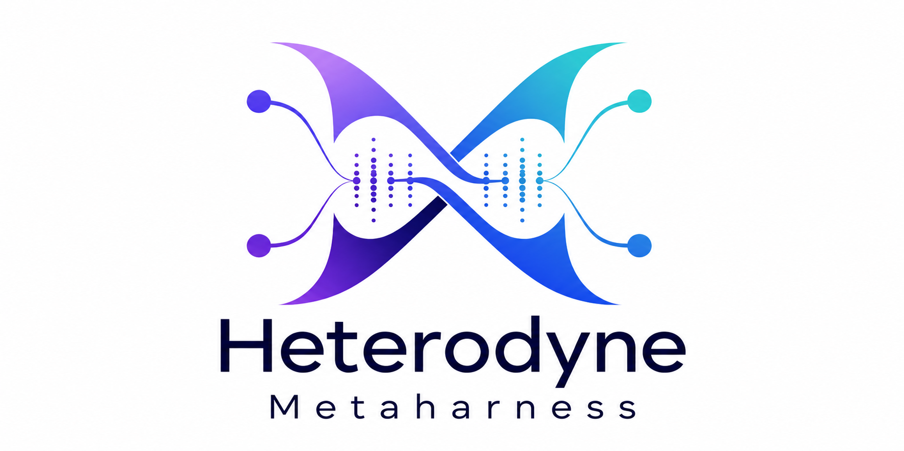

<p align="center">
  <a href="https://github.com/HeterodyneNetwork/HeterodyneProtocol">
    
  </a>
</p>

# Heterodyne Metaharness

Keep a coding workstream going across terminal exits, context compaction, and
machine restarts. The metaharness supervises a coding agent and a separate
[Hermes](https://github.com/NousResearch/hermes-agent) manager, gives them a
shared [Marmot](https://github.com/marmot-protocol/mdk) project channel, and
records enough state to recover the right conversations and task ownership.

**Development status:** The metaharness is actively being developed while
dogfooding itself. Expect interfaces and deployment procedures to evolve; use
the [active specification](spec/README.md) and linked runbooks for current
operational details.

## How it fits together

| Piece | What it does |
| --- | --- |
| Supervisor | Stores run state, checkpoints, inboxes, and delivery receipts in SQLite. |
| Worker and manager | Runs a Codex or Claude Code worker alongside a Hermes manager in persistent tmux panes. |
| Marmot channel | Carries project messages, status, and operator steering through the existing Hermes gateway. |
| Beads queue | Keeps task ownership and handoffs durable across agent sessions. |
| systemd user service | Restarts the supervisor after a crash or Linux reboot. |

The core is Python, with agent and messaging differences behind adapters. A
restart restores conversations and reports uncertain work; it does not replay
an old prompt or automatically rerun a command.

## Start here

This is an operator-oriented project, not a one-command hosted service. A Linux
host needs Python 3, tmux, a systemd user session, Hermes with its Marmot
integration, a configured Beads queue, and at least one supported coding agent.
The installers work with an existing Hermes home and Marmot configuration; read
the deployment steps before applying them to a live installation.

1. Read the [active specification](spec/README.md) for the current contract and
   the [deployment runbook](docs/maintenance-deployment.md) for setup and review.
2. Use the [module registry](MANIFEST.md) to find the implementation area you need.
3. After installation, try `workstream doctor`, then use the example commands
   below to start and inspect a workstream.

For detailed results, see the [maintenance execution evidence](docs/maintenance-execution-evidence.md).
SQLite runtime repair has a separate [runbook](docs/sqlite-runtime-repair.md) and
[deployment record](docs/sqlite-runtime-execution-evidence.md).

More feature guides:

Shared brain notifications: [contract](spec/brain.md) and [deployment steps](docs/brain-notifications.md), and [execution evidence](docs/brain-notifications-execution-evidence.md).

Task admission and addendums: [contract](spec/tasks.md) and [deployment steps](docs/task-addendums.md).

Marmot reactions: [contract](spec/reactions.md) and [deployment steps](docs/marmot-reactions.md).

## Commands

```sh
workstream maintenance --title 'Hermes improvement' --file task.txt --key REQUEST_ID
workstream start project /absolute/repository codex --file task.txt
workstream start project /absolute/repository claude --file task.txt --group EXISTING_GROUP
workstream list
workstream status project
workstream send project --file steering.txt                    # to manager
workstream send project --target worker --file steering.txt    # direct coder steering
workstream event project --state completed --text 'Verified result and evidence'
workstream resume project                                     # restore conversations, no task replay
workstream stop project                                       # preserve worktrees, groups and history
workstream doctor
```

Start is idempotent by name; repeats never replace a manifest or resubmit input. A conflicting repository/agent is rejected. Reuse the project group; only one nonterminal run owns a repository/group. Use a new name after stopping an old run if starting genuinely new work. An uncertain creation result requires `workstream bind-group NAME GROUP_ID` rather than creating duplicates. A failed startup is visible; after correcting it, recover the conversation with `resume`, then explicitly steer the task.

The supplied `workstream-start NAME REPO AGENT [PROMPT] [GROUP]`, `workstream-stop`, `workstream-reconcile` and `twrap` entry points delegate to this implementation. No independent watchdog or progress-relay process is needed. `twrap` preserves command argv and working directory; arbitrary commands are never replayed after reboot.

## Recovery and compaction

State lives in `$HERMES_HOME/workstreams/harness.sqlite3`, independent of all model contexts. Each run has an inspectable `workstreams/runs/RUN_ID/checkpoint.json`, separate manager/worker identities, exact native session IDs when discoverable, last observations, input submission states and a durable message outbox.

Stable aliases `workstream-NAME-worker` and `workstream-NAME-manager` resolve to the same run and Marmot group across native session-ID changes. `workstream identities NAME` shows current bindings and predecessor history. Claude receives its native display name; Codex uses the external alias because its installed CLI has no equivalent startup naming flag. Codex/Claude SessionStart hooks register successor IDs and inject checkpoint context; Hermes compression chains are followed from its persisted session lineage. Existing Codex hooks are preserved and only the exact added hook hash is trusted.

A changed Linux boot ID queues an interruption report with the last observation, then restores native conversations without a prompt. Unknown native identity opens a blank worker and says so. Arbitrary command jobs remain interrupted. A recovered manager/worker waits for explicit steering; previous tests, builds and tools are not automatically replayed. A same-boot crash during a non-idempotent submit or launch is reported as uncertain, never retried blindly. `resume` restores conversation state and does not itself authorize task execution.

Pre-interruption pending input becomes `held`; `workstream inbox NAME` exposes it for inspection. Fresh user messages remain routable. Recovery cannot silently execute an old queued instruction.

Compaction keeps the native identity and durable supervisor state; native Codex/Claude lifecycle events retain explicit turn-completion and compacted markers. A turn ending never means the whole task completed. The manager verifies task outcome and records it through `event`. Manager responses also relay from its persisted transcript when available.

## Reporting and routing

Operator questions use [durable asks and admin tags](spec/operator-asks.md).
See the [reviewed deployment procedure](docs/operator-asks-deployment.md) for
admin lookup configuration, existing live-home constraints and verification.

Every ongoing run, including unknown, blocked and failed states, queues a status at most every 240 seconds plus a 10-second observation tick. Delivery runs separately, validates acknowledged Marmot responses, retries using the same remote idempotency key, and escalates after three failures. Network outages cannot guarantee delivery; `doctor` exposes backlog and oldest pending report, and messages survive outages/restarts. Transports and tmux input do not share an exactly-once transaction: uncertain input requires inspection.

The installed Marmot hook sends authenticated messages for an owned channel to its durable manager inbox, before ordinary gateway dispatch. Unowned channels use the normal gateway. New groups require no gateway restart once the hook is installed. Duplicate inbound IDs cannot create duplicate manager inputs. Inputs retain their explicit target across restart.

## Context, search, and session recall

Both coding adapters receive deterministic compaction and search settings at launch.
The target is **half the real model window, capped at 500,000 tokens**. Installed
Codex metadata currently advertises 272,000 tokens for `gpt-6-astra`, so its trigger
is 136,000 tokens. Claude uses its native 50% override and a maximum 1,000,000-token
compaction window. These settings apply to new or restarted native processes.
See [context/search details](docs/context-search.md) for unknown-model behavior.

Both agents can use Semble MCP for code discovery and native tools for web search.
Existing approval settings and explicit denials remain effective. Auto-memory is
pinned in an isolated venv; `workstream-recall AGENT list|search --repo PATH` scopes
recall to the canonical repository and its existing worktrees. Add `--query PHRASE`
for search. SessionStart and compaction recovery supply bounded metadata, not a
per-prompt history dump. Upstream Codex recall currently rejects this host's newer
schema and has no search; the harness supplies a separate read-only JSONL fallback.
See [compatibility and limits](docs/auto-memory.md).

## Passing Beads tasks

The `workstream task` facade supplies a stable owner/session identity independent
of native compaction IDs and routes operations through the shared Beads queue:

New runs default to their run name as the workstream, with pickup paused. A configured
shared queue workstream overrides that name; use `--workstream` when selecting it
explicitly. The launcher passes deterministic `BTQ_WS` and `BTQ_SESSION_ID` to workers.

```sh
workstream task project --workstream SLUG create --title 'Fix delivery' --file task.txt --key delivery-fix-v1
workstream task project --workstream SLUG bind ISSUE_ID
workstream task project --workstream SLUG context
workstream task project --workstream SLUG resume
workstream task project --workstream SLUG claim ISSUE_ID
workstream task project --workstream SLUG close ISSUE_ID --evidence-file result.txt
```

Creation with the same operation key is idempotent. Bind records a reference;
claim acquires ownership atomically. Routing, dependencies and Claude implementation
approval remain enforced. `pause` stops pickup for direct user work; `ready` checks
once, without polling. Closing checks once between tasks without claiming the next
one. After reboot, `recover --evidence-file recovery.txt` reconciles durable ownership
but leaves pickup paused until explicitly resumed. A Claude task still needs the
shared queue's two-model ADR and separate human approval before implementation.

## Disk usage decision

[agenticow](https://github.com/ruvnet/agenticow) branches vector-memory indexes using
copy-on-write. It does not compress native Claude/Codex transcripts or Git worktrees.
This harness does not duplicate vector indexes, and Git worktrees already share
repository object storage. The inspected host used approximately 440 KiB for
workstream state versus 2.4 GiB for Codex and 1.7 GiB for Claude storage. Installing
agenticow would add another storage system without addressing the measured usage,
so it is not installed. Any later archive/retention policy must preserve native
resume history and durable ownership. Separately reviewed historical cleanup is
recorded in the [maintenance execution evidence](docs/maintenance-execution-evidence.md).

## Deployment

Run `python install.py` with Hermes's venv Python to load current Marmot member configuration, then `python install_routing.py ~/.hermes/plugins/marmot/adapter.py`. First routing installation needs a gateway restart. The installer backs up replaced files and is idempotent. It creates `~/.config/systemd/user/hermes-workstreams.service`; enable user lingering for unattended boot (`loginctl show-user "$USER" -p Linger`). A dedicated `tmux -L hermes-workstreams` server retains interactive panes and exit status.

Run `python3 install_capabilities.py` for native global context/search defaults and
Semble registration, and `python3 install_memory.py /path/to/auto-memory` for the
reviewed revision's isolated package, wrappers and preserved global recall blocks.

Configuration: `workstreams/harness-config.json` supplies `marmot` (bootstrap, socket, members, relays, timeout), `ops_group`, `tmux_socket`, `manager` executable/extra_args and CLI path. Per-worker `--agent-config` supplies explicit executable/extra_args. No permission bypass or approval-key automation is added. Worktrees and channels are preserved on stop; cleanup is a separately reviewed operation.

Legacy manifests can be imported with `workstream import-legacy`; they remain archived for inspection rather than automatically resurrecting historical tasks. Resume selected records explicitly after checking them.

## Verification

```sh
python3 -m unittest discover -s tests -v
```

Tests use temporary state, fake coding executables, isolated real tmux sockets and local mock Marmot servers. They never reboot the host, call real models, create real channels or send real messages.

Native idle/status, per-Bead checkout boundaries and harness approval tuning:
[contracts](spec/status.md), [worktrees](spec/worktrees.md), [approvals](spec/approvals.md),
and [deployment/review runbook](docs/workstream-lifecycle.md).

Separate implementation, review and deployment ownership:
[linked delivery contract](spec/delivery-tasks.md) and [operations](docs/delivery-tasks.md).

Deterministic task notices: [contract](spec/transitions.md), [rollout](docs/transition-delivery.md).

## Projects this builds on

Thanks to the maintainers and contributors of the tools that make this harness
possible:

| Project | Role here |
| --- | --- |
| [Marmot Development Kit (mdk)](https://github.com/marmot-protocol/mdk) | Marmot and White Noise messaging stack used by the Hermes channel integration. |
| [Beads](https://github.com/GastownHall/beads) | Task tracking foundation for the shared queue and durable handoffs. |
| [tmux](https://github.com/tmux/tmux) | Persistent interactive worker and manager terminals. |
| [Hermes Agent](https://github.com/NousResearch/hermes-agent) | Manager runtime and gateway integration. |
| [Codex](https://github.com/openai/codex) and [Claude Code](https://github.com/anthropics/claude-code) | Supported coding agent runtimes. |
| [Python](https://www.python.org/), [SQLite](https://www.sqlite.org/), and [systemd](https://systemd.io/) | Supervisor implementation, durable local state, and service lifecycle. |
| [Git](https://git-scm.com/) | Isolated worktrees for coding tasks. |
| [Semble](https://github.com/MinishLab/semble), [Ripwire](https://github.com/redhat-et/ripwire), and [auto-memory](https://github.com/dezgit2025/auto-memory) | Code discovery, structural inspection, and optional session recall. |

The logo above adapts the [Heterodyne Protocol logo](https://github.com/HeterodyneNetwork/HeterodyneProtocol/blob/main/docs/assets/heterodyne-logo.png): its wordmark was changed to “Metaharness” and its layout was widened. The upstream artwork is available under [CC BY 4.0](https://github.com/HeterodyneNetwork/HeterodyneProtocol/blob/main/LICENSE).

## License

This project's code and documentation are licensed under the [Apache License 2.0](LICENSE). The adapted logo retains the upstream CC BY 4.0 attribution and license described above.
